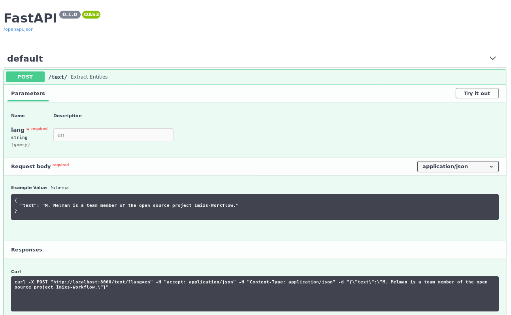

[
  {
    "label": "part",
    "text": "watch"
  },
  {
    "label": "part",
    "text": "Klavier"
  }
]# Imixs-ML

Imixs-ML is a microservice project with the goal to provide a NPL Named Entity Recognition Service for Business Process Management.

The project is at the moment experimental only.

# Imixs-ML Service

The subproject Imixs-ML Service provides a ML Service based on the spaCy ML library. The service can be run in a Docker container. 

# Imixs-ML Learning

The subproject Imixs-ML Learning provides Java based components to be integrated into a Imixs-Workflow project to update or create a SpaCy Model.

# Docker

In this project we provide a Docker image which is based on [tiangolo/uvicorn-gunicorn-fastapi-docker](https://github.com/tiangolo/uvicorn-gunicorn-fastapi-docker). This image comes with Uvicorn managed by Gunicorn for high-performance FastAPI web applications in Python 3.7. The image has an "auto-tuning" mechanism included, so that it is very easy to add custom Rest-API resources. 

To build the image from the Dockerfile run: 

    $ docker build --tag=imixs/imixs-ml .

To test the image run the container in an interactive mode:
    
	$ docker run --rm --name="imixs-ml" -it \
			-p 8000:8000 \
			imixs/imixs-ml

Open the api documentation via:

	http://localhost:8000/docs
	
You can test the service with curl:

	$ curl -X POST "http://localhost:8000/text/?lang=en" -H  "accept: application/json" -H  "Content-Type: application/json" -d "{\"text\":\"M. Melman is a team member of the open source project Imixs-Workflow.\"}"

You your can test from the swagger UI http://localhost:8000/docs

The following example for a POST request...

	{
	  "text": "M. Melman is a team member of the open source project Imixs-Workflow."
	}

...will result in an output like this:

	[
	  {
	    "label": "person",
	    "text": "Melman"
	  },
	  {
	    "label": "project",
	    "text": "Imixs-Workflow"
	  }
	]

# Development

You can use the Eclipse IDE with the Pydev plugin for development.
To prepare you environment make sure that pyhton 3.7 and pip3 is installed correcty.

To install pip3 on debian run:

	$ sudo apt install python3-pip
	
Next you can import the spacy and fastapi dependencys

	$ pip3 install -r requirements.txt

## Eclipse Setup

If you use the Eclipse Plugin Pydev make sure you added the spacy lib folder.
In the properties for your pydev project, there's a pane called "PyDev - PYTHONPATH", with a sub-pane called "External Libraries". You can add source folders to the path using that pane. Your project code will then be able to import modules from those source folders. For spacy this may be the folder _~/.local/lib/python3.7/site-packages/spacy_

# Contribute

_Imixs-ML_ is open source and your are sincerely invited to participate in it. 
If you want to contribute to this project please [report any issues here](https://github.com/imixs/imixs-ml/issues). 
All source are available on [Github](https://github.com/imixs/imixs-ml). 

## License

Imixs-ML is free software, because we believe that an open exchange of experiences is fundamental for the development of valuable software. All results of this project are provided under the [GNU General Public License](http://www.gnu.org/licenses/gpl-3.0.en.html). 
