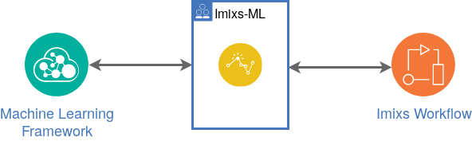

# Imixs-ML

Imixs-ML is a machine learning framework for [Imixs-Workflow](https://www.imixs.org). The project provides several microservices and APIs which integrate into an Imixs-Workflow environment. This project provides a generic machine learning API to adapt different ML frameworks like the [spaCy API](https://spacy.io/) or [Apache mxnet](https://mxnet.apache.org/). In this way the Imixs-ML project combines the concepts of machine learning with the concepts of business process management. This is a powerful and very flexible solution to digitize business processes.

The project consists of the following modules:

 * [Imixs-ML Core](./imixs-ml-core/README.md) - java core libraries to be used to access different machine learning frameworks
 * [Imixs-ML API](./imixs-ml-api/README.md) - a microservice to be integrated into a Imixs-Workflow environment
 * [Imixs-ML spaCy](./imixs-ml-spacy/README.md) - a wrapper service for [spacy.io](https://spacy.io/)
 
 
# Imixs-ML Core

The module Imixs-ML Core defines the core interface to access a machine learning framework. It is providing java object classes and a client to access a ML framework.. 

Learn more in the section [Imixs-ML Core](./imixs-ml-core/README.md).  

# Imixs-ML API

The Imixs-ML API defines a generic API to exchange business data with a machine learning framework. This api defines an object class to train a ml-model as also an obejct class to analyse business data.

Learn more in the section [Imixs-ML API](./imixs-ml-api/README.md).  

# Imixs-ML spaCy

Imixs-ML-spaCy is a wrapper service to adapt the [spaCy API](https://spacy.io/) for the Imixs-ML framework. 

Learn more in the section [Imixs-ML spaCy](./imixs-ml-spacy/README.md). 

# Contribute

_Imixs-ML_ is open source and your are sincerely invited to participate in it. 
If you want to contribute to this project please [report any issues here](https://github.com/imixs/imixs-ml/issues). 
All source are available on [Github](https://github.com/imixs/imixs-ml). 

## License

Imixs-ML is free software, because we believe that an open exchange of experiences is fundamental for the development of valuable software. All results of this project are provided under the [GNU General Public License](http://www.gnu.org/licenses/gpl-3.0.en.html). 
