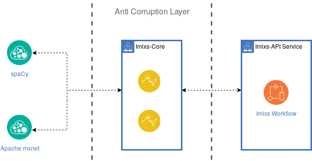

# Imixs-ML - Core

The Imixs-ML Core module defines the core interface to access a machine learning framework. It provides Data Object classes and a RestFull Client to exchange data between the *Imixs-Workflow Engine* and a ML Engine. 

In this way the Imixs-ML Core API acts as an *Anti Corruption Layer* between the Imixs-ML API Service and ML Engine like [spaCy](https://spacy.io/) or [Apache mxnet](https://mxnet.apache.org/).

## The TrainingData Object

To train a ml-model an array of TraingData objects can be sent to the API resource /trainingdata/

A training data object array is defined by the following JSON structure:

	[
	  {
	    "text": "String",
	    "entities": [
	      {
	        "label": "string",
	        "start": 0,
	        "stop": 0
	      }
	    ]
	  }
	]
	
Each Training Data object contains a *text* and a list of *entity* objects. A single entity object is defined by its label and the start/stop position within the training text. So it is possible to define multiple entity objects for one training text. See the following example:

	[
	  {
	    "text": "Imixs Workflow in an open source project organized from Munich.",
	    "entities": [
	      {
	        "label": "project",
	        "start": 0,
	        "stop": 14
	      },
	      {
	        "label": "city",
	        "start": 56,
	        "stop": 62
	      }
	    ]
	  }
	]
  

## The AnalyseData Object

To analyse a text based on a ml-model a AnalyseData object can be send to the API resource /analyse/

An AnaylseData object has the following JSON structure:

	{
	  "text": "string"
	}

