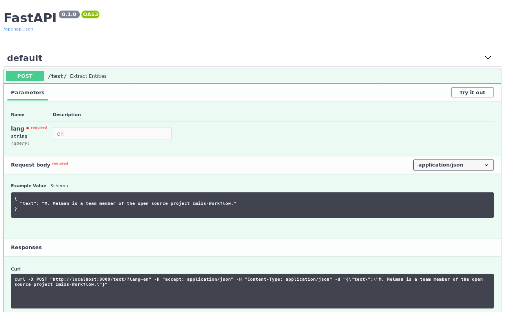

# Imixs-ML-spaCy

Imixs-ML-spaCy is a wrapper service to adapt the [spaCy API](https://spacy.io/) for the Imixs-ML framework. The service is based on the [Imixs-ML-API](../imixs-ml-api/README.md). 

# Docker

The Imixs-ML-spaCy service runs in a Docker container and can be deployed in a container environment like Kubernetes or Docker Swarm.  

The image is based on the [tiangolo/uvicorn-gunicorn-fastapi-docker](https://github.com/tiangolo/uvicorn-gunicorn-fastapi-docker) provided Uvicorn. Uvicorn managed by Gunicorn is a high-performance FastAPI application framework written in Python 3.7. The image has an "auto-tuning" mechanism included. This makes it very easy to add custom Rest-API resources like the Imixs-ML API. 

## Build and Run

To build the image from the Dockerfile run: 

    $ docker build --tag=imixs/imixs-ml-spacy .

To test the image run the container in an interactive mode:
    
	$ docker run --rm --name="imixs-ml-spacy" -it \
	  -p 8000:8000 \
	  imixs/imixs-ml-spacy

**Note:** When running imixs-ml-spacy in docker-compose you should set the environment variable *PYTHONUNBUFFERED* to 1. This forces python flushing its stdout. 

	imixs-ml-spacy: 
	  image: imixs/imixs-ml-spacy
	  environment:
	    PYTHONUNBUFFERED: 1
	    ports:
	    - "8000:8000" 
      

### The Model

The default model path for the service is set to *models/*. You can of course overwrite the path to provide you own one:

	$ docker run --rm --name="imixs-ml-spacy" -it \
	  -e MODEL_PATH="my-models" \
	  -p 8000:8000 \
	  imixs/imixs-ml-spacy

Each rest API resource expects the name of the model as a parameter. Together with the MODEL_PATH this is the location of the spacy model. 

### Language Support

The spaCy API provides different language models. The model language is set by ISO code of the language class to load. The default value is *en*. You can overwrite the model language by setting the environment variable *MODEL_LANGUAGE*

	$ docker run --rm --name="imixs-ml-spacy" -it \
	  -e MODEL_LANGUAGE="de" \
	  -p 8000:8000 \
	  imixs/imixs-ml-spacy
	  
**Note:** The language is only relevant for creating a new model. You should not change the language for an existing model.	  

## Access the API from your Web Browser

The Imixs-ML-spaCy wrapper service provides a web front-end to access the api for testing: 

	http://localhost:8000/docs
	
Open this link in your web browser 

	
Of course you can also test the service with curl:

	$ curl -X POST "http://localhost:8000/text/?lang=en" -H  "accept: application/json" -H  "Content-Type: application/json" -d "{\"text\":\"M. Melman is a team member of the open source project Imixs-Workflow.\"}"

## Testing 

The following example for a POST request...

	{
	  "text": "M. Melman is a team member of the open source project Imixs-Workflow."
	}

...will result in an output like this:

	[
	  {
	    "label": "person",
	    "text": "Melman"
	  },
	  {
	    "label": "project",
	    "text": "Imixs-Workflow"
	  }
	]

# Development

You can use the Eclipse IDE with the [Pydev plugin](https://www.pydev.org/) for development.
To prepare you environment make sure that pyhton 3.7 and pip3 is installed correctly.

To install pip3 on debian run:

	$ sudo apt install python3-pip
	
Next you can import the spacy and fastapi dependencys

	$ pip3 install -r requirements.txt

## Eclipse Setup

If you use the [Eclipse Plugin Pydev](https://www.pydev.org/) (which is recommended) make sure you added the spacy lib folder.
In the properties for your pydev project, there's a pane called "PyDev - PYTHONPATH", with a sub-pane called "External Libraries". You can add source folders to the path using that pane. Your project code will then be able to import modules from those source folders. For spacy this may be the folder _~/.local/lib/python3.7/site-packages/spacy_

# Docker Hub

To push the latest image to a repository run:

	$ docker build -t imixs/imixs-ml-spacy:latest . 
	$ docker push imixs/imixs-ml-spacy:latest