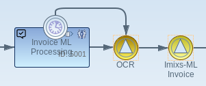
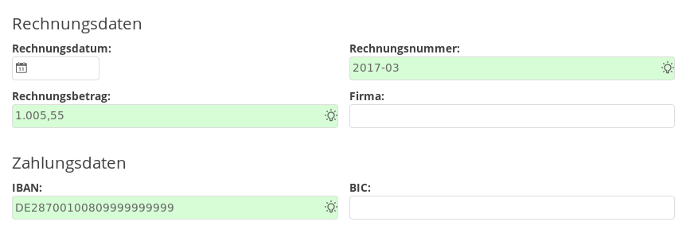

# Imixs-ML Workflow

The Imixs-ML Workflow module provides Adapter classes and CDI Beans to integrate machine learning into the workflow processing life cycle.

The Adapter class 'MLAdapter' is used for *Natural language processing (NLP)* within the processing life cycle on a workflow instance. The adapter can analyse the text of documents and extract relevant business data for a running business process. 

The CDI bean 'MLController' is used for user interaction like data input, data verification and data confirmation. 

## The MLAdapter

The adapter 'org.imixs.ml.workflow.MLAdapter' is used for ml analysis against a ML Service endpoint. The MLAdaper automatically analyses the text content of all attached documents, and stores entities found in the text into corresponding items.  

### Configuration by Properties

The MLAdapter can be configured by the imixs.properties  '*ml.service.endpoint*' and '*ml.locales*' 

	ml.service.endpoint=http://imixs-ml-spacy:8000/analyse/
	ml.locales=DE,UK

Optional the parameters can be set by the environment variables *ML_SERVICE_ENDPOINT* and *ML_LOCALES*.

### Configuration by the Model

The MLAdapter can be optional be configured through the model by defining a workflow result item named '*ml.config*'.

See the following example:
    
	<ml-config name="endpoint">
	    https://localhost:8111/api/resource/
	</ml-config>
	<ml-config name="locales">DE,UK</ml-config>

Per default the MLAdapter takes all entities into the current workitem if an item with the name did not yet exist. 
To configure the behavior of the entity adaption in a more fine grained way, optional configuration via the workflow
 model is possible with the item 'ml.entity':

	<ml-config name="entity">
	    <name>_invoicetotal</name>
	    <type>currency</type>
	</ml-config>
	<ml-config name="entity">
	    <name>_cdtr_bic</name>
	    <type>text</type>
	    <mapping>bic</mapping>
	</ml-config>
	

In this example the entity '_invoicetotal' will be adapted by the Currency Adapter. 
The entity '_cdtr_bic' will be mapped into the item 'bic'.

### Named Entity Recognition (NER)

The MLAdapter sends text from documents to the ML Service endpoint for Named Entity Recognition (NER). The results will automatically stored into the current process instance. 

The ML Adapter creates a field 'ml.items' with all item names which are part of the NER.
This means even if an entity was not found in the document content, but was configured by the bpmn model, the entity name will
be part of 'ml.items'. With this mechanism, as new entity can later be trained even if the entiy is yet not part of the model.

## The MLService

The MLService is a stateless EJB reacting on Processing events. The service updates the  ml.status item. If no ml.status item
 exists, and ml.items is not empty, than the status is set to 'suggest'. If the status is 'suggest' and the current event is 'public' than the status is set to 'confirmed'
 
 The item '*ml.status*' has one of the following options:

 - suggest - not yet confirmed by the user
 - confirmed - confirmed by the user
 - training - workitem is ready for a training

The status 'training' indicates that all known entities are filled with data found in the document content. This means that this worktiem can be used for later training. See the 'ML TrainingScheduler'.

## The MLController

The MLController is a request scoped CDI bean used to verify and confirm ML data.
The method *getJSON()* returns a json object indicating the current status and the list of ml items.
This method is used in JavaScript to get the ml status information:

	<ui:fragment rendered="#{mlController!=null}">
		<!-- imixs-ml -->
		
		
	</ui:fragment>

   
### ML Input

With the JavaScrit library 'imixs-offic.ml.js' input fields with a computed value from the ml analysys can be highlighted to give the user a hint that the value of a field comes from the ml engine.

The script library adds a css class named 'imixs-ml' to a input field associated with a ml entity. You can add a custom stile for this css class into your application:

	.imixs-ml {
		background: url(./idea_16.png) no-repeat scroll right #d6fdd6 !important;
		background-position: 100% 5px !important;
	} 

	
	
### ML Suggestion

Imixs-ML Workflow provides a UI widget that allows the user to search a text phrase within the document content. This helps to generate valid training data, as the text values of input items are part of the document content which is important for later training.

## ML Training Scheduler

The service MLTrainingScheduler is a managed executer service which is sending the collected training data of a workitem to the ML training service. A workitem is ready for training, if all entity values are confirmed by the user. This in indicated by the status 'training' stored n the item 'ml.status'
