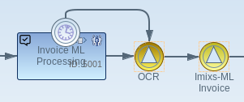

# Imixs-ML Workflow

Imixs-ML Workflow module proivdes Adapter and Plugin classes to be used for machine learning within the workflow processing life cycle.

## The MLAdapter

The adapter 'org.imixs.ml.workflow.MLAdapter' is used for ml analysis based againsed a ML Service endpoint. The MLAdaper automatically analyses the text content of all attached documents, and stores entities found in the text into corresponding items.  

### Configuration by Properties

The MLAdapter can be configured by the imixs.properties  '*ml.endpoint*' and '*ml.locales*' 

	ml.endpoint=http://imixs-ml-spacy:8000/analyse/
	ml.locale=DE,UK

Optional the parameters can be set by the environment variables *ML_API_ENDPOINT* and *ML_LOCALES*.

### Configuration by the Model

The MLAdapter can be optional configured through the model by defining a workflow result item named '*ml.config*'.

See the following example:

	<item name="ml.config">
	    <endpoint>https://localhost:8111/api/resource/</endpoint>
	    <locales>DE,UK</locales>
	</item>

Per default the MLAdapter takes all entities into the current workitem if an item with the name did not yet exist. 
To configure the behavior of the entity adaption in a more fine grained way optional configuration via the workflow
 model is possible via the item 'ml.entity':

	<item name="ml.entity">
	    <name>_invoicetotal</name>
	    <type>currency</type>
	</item>
	<item name="ml.entity">
	    <name>_cdtr_bic</name>
	    <type>text</type>
	    <mapping>bic</mapping>
	</item>

In this example the entity '_invoicetotal' will be adapted by the Currency Adapter. 
The entity '_cdtr_bic' will be mapped into the item 'bic'.

