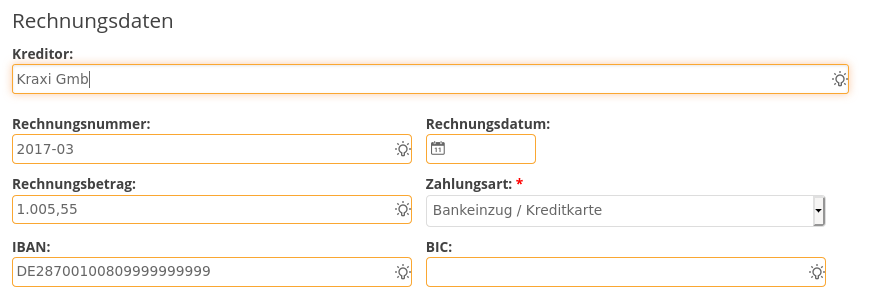

# Imixs-ML Workflow

The Imixs-ML Workflow module provides Adapter classes, CDI Beans and Service EJBs to integrate the Imixs machine learning framework into the workflow processing life cycle.

 - **ML-Adapter** The Workflow Adapter class 'MLAdapter' is used for *Natural language processing (NLP)* within the processing life cycle on a workflow instance. The adapter can analyse the text of documents and extract relevant business data for a running business process. This includes entity recognition and text classification.   

 - **ML-Controler**   The CDI bean 'MLController' is used for user interaction like data input, data verification and data confirmation.    

 - **ML-TrainingScheduler**  The MLTrainingScheduler is a timer service sending training data to a ML Service endpoint.    

## The MLAdapter

The adapter *'org.imixs.ml.workflow.MLAdapter'* is used for ml analysis against a ML Service endpoint. The MLAdaper automatically analyses the text content of all attached documents, and stores entities and categories found in the text into corresponding items.  

### Configuration by Properties

The MLAdapter can be configured by the following imixs.properties 

 - *ml.service.endpoint* - defines the serivce endpoint of tha machine learning framework based on the Imixs-ML-Core API
 - *ml.model* - the default model name to be used
 - *ml.locales* list of supported language locales

The parameters can be set in the imixs.properties or as environment variables:

	ML_SERVICE_ENDPOINT=http://imixs-ml-spacy:8000/
	ML_MODEL=invoice-model-1.0.0
	ML_LOCALES=de_DE,en_GB

All these parameters can be overwritten by the model.

### Configuration by the Model

The MLAdapter can also be configured through the model by defining a workflow result item named '*ml-config*'.

See the following example:
    
	<ml-config name="endpoint">
	    https://localhost:8111/api/resource/
	</ml-config>
	<ml-config name="model">invoice-model-1.0.0</ml-config>
	<ml-config name="locales">de_DE,en_GB</ml-config>

### Item Mapping

Per default the MLAdapter takes all entities into the current workitem if an item with the name did not yet exist. 
To configure the behavior of the entity adaption in a more fine grained way, optional configuration via the workflow
 model is possible with the item 'ml-entity':

	<ml-config name="entity">
	    <name>_invoicetotal</name>
	    <type>currency</type>
	</ml-config>
	<ml-config name="entity">
	    <name>_cdtr_bic</name>
	    <type>text</type>
	    <mapping>bic</mapping>
	</ml-config>
	

In this example the entity '_invoicetotal' will be adapted by the Currency Adapter. 
The entity '_cdtr_bic' will be mapped into the item 'bic'.

### Named Entity Recognition (NER)

The MLAdapter sends text from documents to the ML Service endpoint for Named Entity Recognition (NER) and text classification. The results will automatically stored into the current process instance. 

The ML Adapter creates the following items

 - *ml.items* - all item names which are part of the NER.
 - *ml.categories* - all categories from the text classification
 

 
**Note:** Even if an entity was not found in the document content, but was configured by the bpmn model, the entity name will
be part of 'ml.items'. With this mechanism, as new entity can later be trained even if the entity is yet not part of the model.

*ml.categories* are optional and will only be provided if text classification was trained before.

## The MLService

The MLService is a stateless EJB reacting on Processing events. The service updates the  ml.status item. If no ml.status item
 exists, and ml.items is not empty, than the status is set to 'suggest'. If the status is 'suggest' and the current event is 'public' than the status is set to 'confirmed'
 
 The item '*ml.status*' has one of the following options:

 - suggest - not yet confirmed by the user
 - confirmed - confirmed by the user
 - training - workitem is ready for a training

The status 'training' indicates that all known entities are filled with data found in the document content. This means that this worktiem can be used for later training. See the 'ML TrainingScheduler'.

## The MLController

The MLController is a request scoped CDI bean used to verify and confirm ML data.
The method *getStatus()* returns  a JSON object containing the current ml result status and the item names collected by the MLAdatper.

	{
	  "status":"suggest",
      "items": [
        "invoice.number",
        "invoice.total"
      ]
    }

This method can be called in JSF page to handle the status in JavaScript:

	<ui:fragment rendered="#{mlController!=null}">
		
	</ui:fragment>

   
### UI Integration

The project [Imixs-Office-Workflow](https://github.com/imixs/imixs-office-workflow/) provides an example for a UI integration based on the MLCOntroler status and a autocompletion feature.
The subform *workitem-ml.xhtml* demonstrates a full integration with a highlight and autocompletion feature:	

	
### ML Autocompletion

To support autocompletion teh MLController provides a method to search for a text phrase within the document content. This helps to generate valid training data, as the text values of input items are part of the document content which is important for later training.

## ML Training Scheduler

If the ml status of a workitem was already confirmed and the workitem type is 'archive', than the MLService set the ml status to 'training' and a eventLog entry is created to indicate that this workitem can be send to the training service. 

**Note:** the training service can reject the workitem for training if the data is of an insufficient quality.

The service MLTrainingScheduler is an EJB Timer Service sending the collected training data of a workitem to the ML training service. A workitem is ready for training, if all entity values are confirmed by the user. This in indicated by the status 'training' stored n the item 'ml.status'. The service can be configured by the following configuration parameters:

 - ML_TRAINING_SCHEDULER_ENABLED - true|false
 - ML_TRAINING_SCHEDULER_INTERVAL - scheduler interval in milliseconds
 - ML_TRAINING_SCHEDULER_INITIALDELAY - initial delay during first startup (deployment) 
 
To activate the Training Scheduler the service need to be enabled (it is disabled per default). See the following example configuration:

	ML_TRAINING_SCHEDULER_ENABLED=true
	ML_TRAINING_SCHEDULER_INTERVAL=30000
	ML_TRAINING_SCHEDULER_INITIALDELAY=60000

This setting will enable the training scheduler with an interval of 30 seconds and an initial delay of 60 seconds. 
  
### The Training Quality Level
  
The training scheduler will only train data with a training quality level="PARTIAL" or "FULL". The  training quality level="PARTIAL" is the default setting. 

 - ML_TRAINING_QUALITYLEVEL=FULL  - all ML Items of a workitem must provide matching values. 
 - ML_TRAINING_QUALITYLEVEL=PARTIAL -  empty values are allowed (default).

It is possible to force the training quality level "FULL" with the environment 'ML_TRAINING_QUALITYLEVEL': 

	ML_TRAINING_QUALITYLEVEL=FULL

**Note:** If a workitem provide no value for a item, but the corresponding text is part of the text, this may lead to a decrease of the overall ml model quality. 
